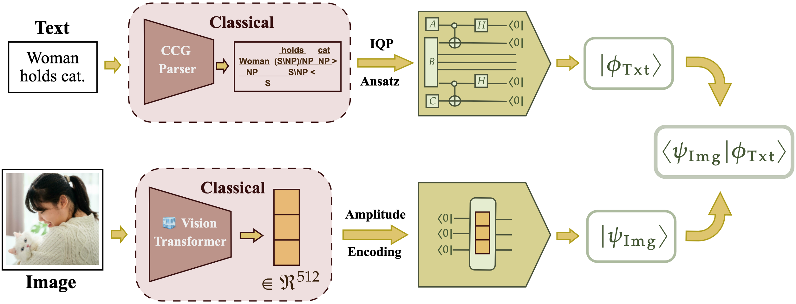
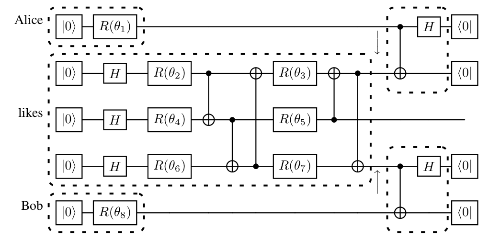
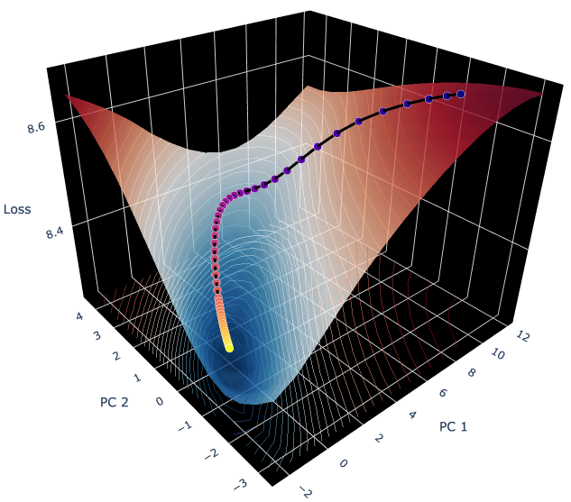

# QuLIP: A Variational Quantum Encoder for Vision-Language Understanding

[](https://www.python.org/)
[](https://pytorch.org/)
[](https://pennylane.ai/)
[](https://cqcl.github.io/lambeq/)

> **Official implementation of "Meaning Representations as Variational Quantum Circuits"**
> 
> *Tilen G. Limbäck-Stokin, Tanishka A. Birdavade, Kin Ian Lo, Mehrnoosh Sadrzadeh* > Quantum Learning Labs, University College London (UCL)

## 📖 Overview

Classical Vision-Language Models (VLMs) like CLIP rely heavily on unstructured sequences and $O(n^2)$ self-attention, ignoring the compositional nature of language and leading to massive parameter explosions. **QuLIP (Quantum Language-Image Pretraining)** addresses this by mapping syntactic rules—specifically Combinatory Categorial Grammar (CCG)—directly into **Variational Quantum Circuits (VQCs)**.

By treating grammatical compositions as quantum entangling operations and words as parameterized unitary rotations, QuLIP achieves **competitive multimodal alignment (e.g., 83.16% on SVO-Swap)** while utilizing **two orders of magnitude fewer parameters** (10k-100k) than classical baselines like OpenCLIP (63M).

 
*Figure 1: The QuLIP multimodal pipeline. Images are classically embedded and amplitude-encoded into state $|\psi_{img}\rangle$. Sentences are parsed via CCG and topologically mapped to VQCs to generate state $|\phi_{txt}\rangle$. Alignment is computed via a quantum inner product.*

## 🧬 Repository Structure

The codebase is modularized to support CCG parsing, topological circuit compilation, scalable tensor contraction, and custom quantum loss landscapes.

* `data_processing.py`: Handles multimodal dataset ingestion (ARO, SVO-Swap), CLIP image extraction, and maps classical embeddings to PennyLane `AmplitudeEmbedding` states.
* `tree2einsum.py` & `grammar_ext.py`: The core NLP-to-Quantum compiler. Translates Bobcat CCG derivation trees into parameterized unitary ansätze (e.g., `Sim14Ansatz`, `IQPAnsatz`, `BrickworkAnsatz`).
* `model.py`: Contains the `EinsumModel` built on PyTorch and `cotengra`. Compiles VQCs into optimized `einsum` contraction paths for highly scalable, batched quantum simulation. Also contains the **QInfoNCE** loss variants.
* `util.py`: Implements fast, batched quantum gate operations (e.g., `BatchRz`, `BatchCRx`) and the Fubini-Study distance metrics.
* `visualisation.py`: A comprehensive suite for generating PCA-projected 3D loss landscapes, t-SNE alignments, and fidelity density distributions using `plotly` and `seaborn`.
* `example_training.ipynb`: A complete end-to-end training and evaluation loop leveraging `MLflow` for hyperparameter tracking.

## ⚙️ Core Methodologies

### 1. Syntax to Quantum Circuits
We replace classical grammatical function applications with native quantum operations. Words are parameterized by ansätze acting on the $|0\rangle$ state, and function applications (like subject-verb-object reductions) are achieved via Bell-basis measurements and post-selection to the $(|00\rangle+|11\rangle)/\sqrt{2}$ state.


*Figure 2: The structural compilation of "Alice likes Bob". Inductive grammatical biases are explicitly encoded into the circuit topology.*

### 2. The QInfoNCE Objective & Fubini-Study Metric
Standard quantum fidelity creates sharp loss landscapes prone to barren plateaus. To align text and image states contrastively, we employ a smooth Fubini-Study similarity metric:

$$s(|\psi_{txt}\rangle, |\psi_{img}\rangle) = \arcsin(|\langle\psi_{txt}|\psi_{img}\rangle|)$$

Implemented in `model.py` as `QInfoNCE_cos`, this allows for highly stable gradient descent during multimodal alignment.


*Figure 3: 3D projection of the parameter loss landscape during training, mapped via PCA.*

## 🚀 Quickstart

### Installation
Ensure you have Python 3.12+ installed. The required dependencies include `torch`, `lambeq`, `pennylane`, `cotengra`, and `mlflow`.

```bash
# Clone the repository
git clone [https://github.com/YOUR_USERNAME/QuLIP.git](https://github.com/YOUR_USERNAME/QuLIP.git)
cd QuLIP

# Install dependencies (uv recommended for speed)
pip install uv
uv pip install lambeq pandas tqdm pennylane torch clip mlflow cotengra optuna
uv pip install git+[https://github.com/openai/CLIP.git](https://github.com/openai/CLIP.git)
